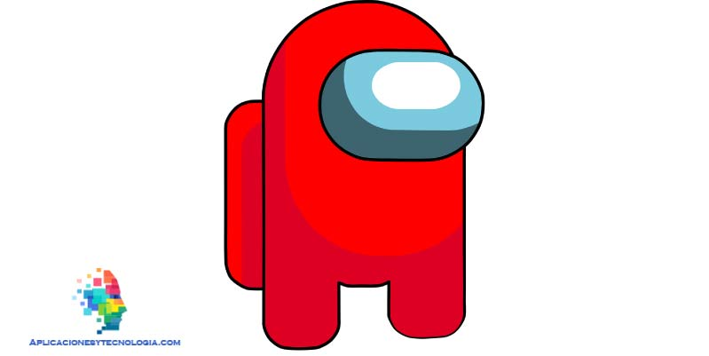

# Project Proposal

1. Roughly, what will your drawing look like
Amoung us 
(link to the website I will be using https://aplicacionesytecnologia.com/among-us/)

3. What are two variables you could use so that when you change each variable, the drawing changes?
Possibly I could chang the entire body or just the mask and the backpack.

4. Where is there repetition in your drawing?
The legs

5. What are the main parts of your drawing? Are there clear sections or objects?
I want to get the circle part to be a little accurate. 

6. How could you use a loop variable of a for loop? Is there somewhere in your drawing where something is repeated, but it's slightly different each time? Maybe the same object is repeated in different places, or maybe a similar object is repeated but with different sizes?
I could use a loop varible to make the legs.

